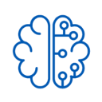
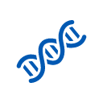
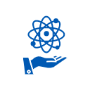

# Technical Resources

Cloudbank's focus is on helping researchers and educators utilize the cloud as a tool for the work they're already doing. The resources in this section help you identify exactly how your work would look in the cloud, and the learning resources to get started on building it.

## Design Patterns

Here are some of the most common patterns we see appear in research cloud infrastructure. Follow the links for guides on how to map this work onto cloud services.

{: .icon-list}
-  HPC
- [ ML and Deep Learning](deep-learning.html)
-  IOT
-  Genomics
- Science Gateways
-  Licensed software platforms

## Solutions

{: .icon-list}
- Containers
- HPC

## Terms and Jargon

Although all cloud platforms offer roughly equivalent functionality, the exact terminology and services available for a given use case differ across them. Below are references to help fill in the gaps.

- [Vendor comparison chart](https://www.cloudbank.org/cloudbank-catalog)

    A chart laying out the equivalent product brand names for most common cloud serivces, across all platforms supported by CloudBank

- [Glossary](https://www.cloudbank.org/cloud-terms)

    A glossary of common terms that you'll see across clouds

---
Cloudbank allows you to allocate your funds however you see fit across four major cloud vendors: [Amazon AWS](https://aws.amazon.com/products/), [Google GCP](https://cloud.google.com/products), [Microsoft Azure](https://azure.microsoft.com/en-us/services/) and [IBM Cloud](https://www.ibm.com/cloud).
---

{: .attribution}
Icons from the Noun Project:

{: .attribution}
- DNA by Start Up Graphic Design 
- Brain, Science by Icongeek26
- IoT, Software, speed by Adrien Coquet